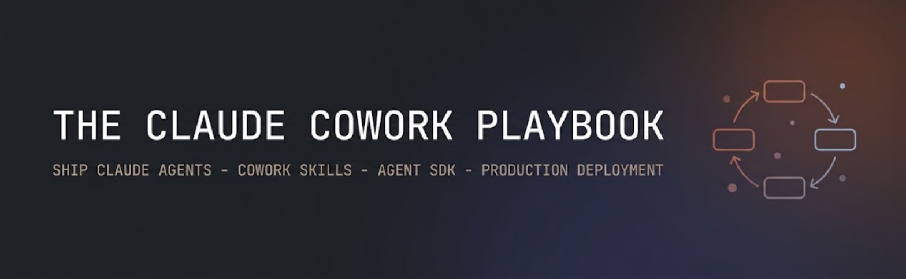
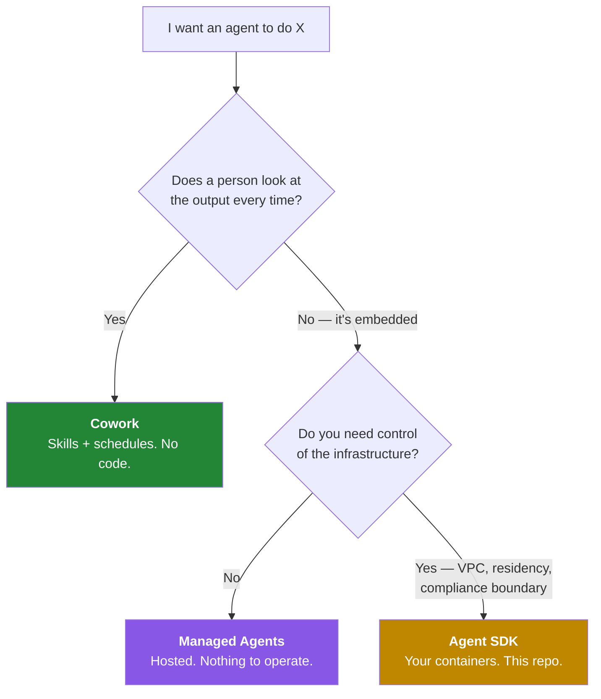

<div align="center">

# The Claude Cowork Playbook

### Everything you need to *use* Claude Cowork and *ship* Claude agents — three production-shaped examples, fully commented, with the deployment and governance nobody puts in the tutorial.

[](LICENSE)
[](examples/01-account-research-agent/)
[](examples/03-inbox-triage-service/)
[](https://code.claude.com/docs/en/agent-sdk/overview)
[](CONTRIBUTING.md)

**[Quickstart](#quickstart-5-minutes) · [The three examples](#the-three-examples) · [Cowork skills](#no-code-start-here) · [Architecture](docs/03-enterprise-architecture.md) · [Deploy](docs/04-deployment-guide.md) · [Security](docs/05-security-and-governance.md)**

</div>

---

## Why this repo exists

Most agent tutorials stop at `hello world`. You get a working `query()` call and then you're on your own for the part that actually takes the time: **what tools to grant, what stops the loop, what it costs, what you show an auditor, and how it survives a container restart.**

This repo is the other 90%. Every file is commented with *why*, not just *what*. Every example is something you could put in front of a review board on Monday.

> **⭐ If you're evaluating Claude for enterprise work, start with [`docs/03-enterprise-architecture.md`](docs/03-enterprise-architecture.md).** It's the reference picture and the five questions an architecture review will actually ask.


<div align="center"><sub>Five layers. The control plane sits <b>between</b> the agent and every capability — not beside it, not after it. That's the only reason any of this is governable.</sub></div>

---

## Quickstart (5 minutes)

```bash
git clone https://github.com/sdaluga/claude-cowork-playbook.git
cd claude-cowork-playbook/examples/01-account-research-agent

python -m venv .venv && source .venv/bin/activate
pip install -r requirements.txt
export ANTHROPIC_API_KEY=sk-ant-...          # from platform.claude.com

python agent.py "Snowflake"
```

You'll watch an agent search, read, cross-check, and write a sourced account brief to `output/`. It logs every tool call and the run's dollar cost.

**No API key?** Start with the [Cowork skills](#no-code-start-here) instead — no code, no key, just a paid Claude plan.

---

## The map

```mermaid
flowchart TB
    subgraph NC["NO CODE — Cowork"]
        direction LR
        S1["deal-brief<br/><i>skill</i>"]
        S2["weekly-account-review<br/><i>skill · scheduled</i>"]
    end

    subgraph CODE["CODE — Agent SDK"]
        direction LR
        E1["01 · Research agent<br/><i>Python · the basics</i>"]
        E2["02 · Document pipeline<br/><i>tools · hooks · subagents</i>"]
        E3["03 · Triage service<br/><i>TypeScript · long-running</i>"]
    end

    subgraph OPS["PRODUCTION"]
        direction LR
        D1["Docker"]
        D2["Kubernetes"]
        D3["OTEL"]
        D4["Governance"]
    end

    NC -->|"you repeated it<br/>3 times"| CODE
    CODE -->|"it runs 100×/day<br/>and nobody watches"| OPS

    style NC fill:#0d2818,stroke:#238636,stroke-width:2px
    style CODE fill:#0c2d6b,stroke:#1f6feb,stroke-width:2px
    style OPS fill:#3d1d00,stroke:#bf8700,stroke-width:2px
```



That left-to-right path is the actual recommendation. Do it by hand in Cowork, notice you've repeated it, write a skill, notice it runs unwatched, port it to the SDK. **Each step is cheap and each one earns the next** — and skills transfer, because the Agent SDK loads them too.

---

## No code? Start here

Two working Cowork skills you can install in about two minutes. → [`cowork/`](cowork/)

| Skill | What it does | Say this |
|---|---|---|
| **[deal-brief](cowork/skills/deal-brief/SKILL.md)** | Turns a folder of call notes, emails, decks and contracts into a **one-page** executive brief with a clear ask and named risks | *"Give me a deal brief for the Contoso folder"* |
| **[weekly-account-review](cowork/skills/weekly-account-review/SKILL.md)** | Runs a Monday review across a portfolio, produces one prioritised action list with reasoning shown, and flags what's gone quiet | *"Run my weekly review"* — or schedule it for 7am Monday |

They're written to be **read** as much as run. The interesting parts aren't the mechanics, they're the constraints:

- `deal-brief` enforces one page. *"If it doesn't fit, cut — do not shrink the font."* A constraint the model can't wriggle out of beats three paragraphs of encouragement.
- `weekly-account-review` **never asks a clarifying question**, because it fires at 7am when nobody's there. It states its assumption and proceeds.
- Both require every claim to cite a file or a date. *"An uncited reason is an opinion wearing a suit."*

> 🪤 **The gotcha that costs everyone an afternoon:** Cowork and cloud sessions do **not** read `~/.claude/skills/` on your machine. They load the skills enabled for your **claude.ai account**. A skill that works in your terminal reports as "not found" in a scheduled task until you enable it on the account. [Full explanation →](cowork/README.md)

---

## The three examples

Each one adds exactly one layer. Read them in order and you'll have the whole picture.

### 🔍 [01 · Account Research Agent](examples/01-account-research-agent/) — Python

**One file, one `query()` call, a sourced brief on disk.** The smallest thing that's still a real agent.

```bash
python agent.py "State Farm" --focus "data platform strategy"
```

Teaches **the three levers** you'll tune on every agent you ever build:

| Lever | Here | Why |
|---|---|---|
| **Tools** | `WebSearch, WebFetch, Read, Write, Glob` — `Bash` explicitly denied | The tool list *is* the blast radius |
| **Permissions** | `permission_mode="acceptEdits"` | Unattended runs |
| **Budget** | `max_turns=40`, `max_budget_usd=2.00` | An agent without a bound is a bill without a bound |

---

### 📄 [02 · Document Pipeline Agent](examples/02-document-pipeline-agent/) — Python

**Unstructured in, structured out, humans only on the exceptions.** A folder of messy invoices becomes a validated CSV, an exceptions report, and a complete audit trail.

```bash
python agent.py                              # runs on the bundled samples
```

Adds the four controls that separate *an agent* from *an agent you're allowed to deploy*:

- **Custom tools** ([`tools.py`](examples/02-document-pipeline-agent/tools.py)) — business rules in your repo, in version control, with tests. Not in a paragraph of prompt.
- **Hooks** ([`hooks.py`](examples/02-document-pipeline-agent/hooks.py)) — a flight recorder for every call, and a write guard a persuasive prompt can't talk past.
- **A permission callback** — allow, deny, or *rewrite* the call.
- **Subagents** — a `Read`-only extractor, so untrusted documents never come near a privileged tool.

> 💣 **Ships with a live prompt-injection test.** [`sample_documents/invoice-c.txt`](examples/02-document-pipeline-agent/sample_documents/invoice-c.txt) contains a real attempt to talk the pipeline into approving a fraudulent total. Run it and watch three independent layers refuse. This is the single most useful forty minutes in the repo.

---

### 📬 [03 · Inbox Triage Service](examples/03-inbox-triage-service/) — TypeScript

**The agent leaves your laptop.** A long-running HTTP service that triages inbound messages, remembers each thread, and survives a restart.

```bash
npm run dev
curl -s localhost:8080/triage -d '{"sessionId":"t-1","body":"Pilot users blocked, go-live Thursday"}'
```

This is where hosting gets real, and it all follows from **one fact**: the SDK spawns a `claude` **CLI subprocess** per session, and that subprocess owns a shell, a working directory, and a transcript on local disk.

| Consequence | What it forces |
|---|---|
| One session = one subprocess | Concurrency is a **RAM** bound, not an event-loop bound |
| Local disk is ephemeral | Anything resumable needs a `SessionStore` |
| Sessions are sticky | Consistent hashing on `sessionId` at the load balancer |

Also: multi-tenant isolation, health vs. readiness, graceful shutdown, and **failing safe rather than closed** — an unparseable response becomes a human's queue item, never a swallowed message.

---

## Production

| | |
|---|---|
| 🐳 **[`deploy/`](deploy/)** | Dockerfile (`tini` as PID 1, non-root, healthcheck), compose with an OTEL collector profile, and Kubernetes manifests — Deployment, session-affine Service, **memory-based** HPA, PDB, NetworkPolicy. Every unusual line commented with the reason. |
| 📐 **[Architecture](docs/03-enterprise-architecture.md)** | The reference picture, the trust boundary, the five decisions a review will ask about, and a maturity model that says most orgs should be at stage 1 and honest about it. |
| 🚀 **[Deployment guide](docs/04-deployment-guide.md)** | Session patterns, sizing formula, egress, `SessionStore`, telemetry, secrets, scaling, and the cost shape. |
| 🔒 **[Security & governance](docs/05-security-and-governance.md)** | Threat model, eight controls, and a **pre-production checklist** you can paste into a review ticket. |

> ### 🪤 The trap that breaks agent containers in CI
> ```dockerfile
> RUN npm ci        # NOT npm ci --omit=optional
> ```
> The TypeScript SDK ships its bundled Claude Code binary through **npm optional dependencies**. Omit them and you get a container that installs cleanly, builds cleanly, and fails at the first `query()` call. It looks like a harmless image-size optimisation. It isn't.

---

## Ten things in here you probably didn't know

1. **There is no top-level session timeout.** A session does not time out on its own — `max_turns` is your only stop.
2. **Token cost dominates infrastructure cost by an order of magnitude or more.** A container is ~$0.05/hour; one long session can spend dollars.
3. **`CLAUDE_CODE_DISABLE_AUTO_MEMORY=1` matters** — auto memory loads into the system prompt *regardless of `settingSources`*.
4. **TypeScript `env` replaces the subprocess environment; Python `env` merges.** Get it backwards in TS and you silently drop `PATH` and your API key.
5. **claude.ai skill uploads accept exactly six frontmatter fields.** Anything else is a hard error, not a warning.
6. **`SessionStore` mirrors transcripts only** — not `CLAUDE.md`, not working-directory artifacts.
7. **Mirror writes are best-effort.** A dropped batch emits `mirror_error` and the query continues. Alert on it.
8. **Scale agents on memory, not CPU.** An agent waiting on a model response uses almost no CPU while holding its full working set.
9. **Cowork's "Automatically approve" consumes more usage** than the other modes, because the safety checks cost compute.
10. **The Agent SDK is Python and TypeScript only.** For any other language, run the CLI as a subprocess with `-p --output-format json`.

---

## Repo layout

```
claude-cowork-playbook/
├── cowork/                          # ← no code required
│   ├── README.md                    #   skills, schedules, connectors, the gotchas
│   └── skills/
│       ├── deal-brief/SKILL.md
│       └── weekly-account-review/SKILL.md
│
├── examples/
│   ├── 01-account-research-agent/   # Python · query(), tools, budgets
│   │   ├── agent.py
│   │   ├── requirements.txt
│   │   └── README.md
│   ├── 02-document-pipeline-agent/  # Python · custom tools, hooks, subagents
│   │   ├── agent.py
│   │   ├── tools.py                 #   in-process MCP server
│   │   ├── hooks.py                 #   audit log + deterministic write guard
│   │   ├── sample_documents/        #   includes a live injection test
│   │   └── README.md
│   └── 03-inbox-triage-service/     # TypeScript · long-running, sessions
│       ├── src/agent.ts
│       ├── src/server.ts            #   semaphore, health/ready, graceful stop
│       ├── package.json
│       └── README.md
│
├── deploy/                          # Docker · compose · Kubernetes · OTEL
│   ├── Dockerfile
│   ├── docker-compose.yml
│   ├── otel-collector.yaml
│   └── k8s/deployment.yaml
│
├── docs/
│   ├── 01-what-is-cowork.md
│   ├── 02-cowork-vs-agent-sdk.md
│   ├── 03-enterprise-architecture.md
│   ├── 04-deployment-guide.md
│   └── 05-security-and-governance.md
│
└── .github/workflows/ci.yml
```

---

## Which one do I use?



**The rule that holds up:** if a person is going to look at the output every time, start with Cowork. Move to the SDK when the same task runs a hundred times a day and nobody is looking. → [full comparison](docs/02-cowork-vs-agent-sdk.md)

---

## Contributing

Issues and PRs welcome — especially working examples in other domains, `SessionStore` adapters, and corrections. See [CONTRIBUTING.md](CONTRIBUTING.md).

**Found this useful? ⭐ Star it** — it's the signal that tells me which parts to go deeper on.

## Official docs

- [Agent SDK overview](https://code.claude.com/docs/en/agent-sdk/overview) · [Quickstart](https://code.claude.com/docs/en/agent-sdk/quickstart) · [Hosting](https://code.claude.com/docs/en/agent-sdk/hosting)
- [Claude Cowork](https://www.anthropic.com/product/claude-cowork) · [Get started with Cowork](https://support.claude.com/en/articles/13345190-get-started-with-claude-cowork)
- [Agent Skills standard](https://agentskills.io) · [Example agents](https://github.com/anthropics/claude-agent-sdk-demos) · [Hosting cookbook](https://github.com/anthropics/claude-cookbooks/tree/main/claude_agent_sdk/hosting)

## License

MIT — see [LICENSE](LICENSE). Use of the Claude Agent SDK itself is governed by [Anthropic's Commercial Terms](https://www.anthropic.com/legal/commercial-terms).

<div align="center">

---

Built by [**Seth Daluga**](https://github.com/sdaluga) · [LinkedIn](https://www.linkedin.com/in/sethdaluga/)

*Not an Anthropic project. Independent, and written from the docs plus a lot of deployment scar tissue.*

</div>
