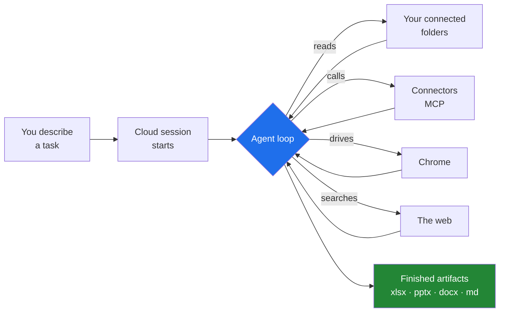
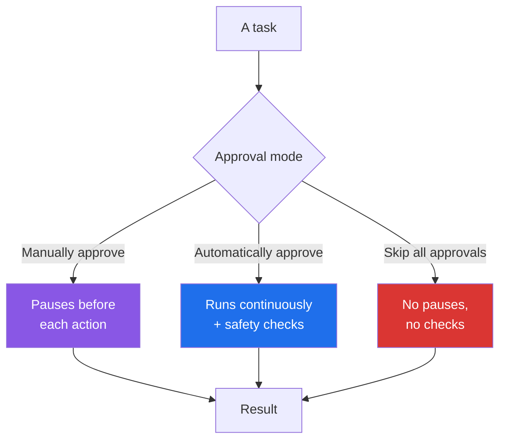

# 1 · What Cowork actually is

> **In one line:** the agentic architecture behind Claude Code, pointed at documents and files instead of repositories, with no terminal.

---

## The shift

A chat assistant answers a prompt. An agentic system takes a task and **executes it** — planning its own steps, calling tools, checking its work, and coming back with a finished artifact.

Cowork is that second thing for knowledge work: research synthesis, document preparation, file management, data extraction. It runs **remotely in Anthropic's cloud**, so you can start a task, close the laptop, and come back to finished work.

## Who it's for

Not developers, specifically. Anthropic aims it at people who *"work with documents, data, and files every day and would rather spend their time on the judgment calls than the assembly"* — researchers, analysts, legal, finance, operations.

That framing is worth taking seriously, because it tells you what to give it. The work Cowork is best at is the work that is **high-effort, repeatable, and currently done by a competent person doing assembly**.

## What it does well

| Capability | What that looks like in practice |
|---|---|
| **Document creation** | Excel with working formulas, PowerPoint decks, formatted Word documents — not just text |
| **File management** | Organise, batch rename, dedupe, and process local files in place |
| **Research synthesis** | Web searches plus your own documents, reconciled into one coherent report |
| **Parallel subagents** | Breaks large work into simultaneous smaller tasks |
| **Browser automation** | Opens Chrome and works on sites — clicking, typing, navigating, filling forms |
| **Extended execution** | Long tasks aren't interrupted by conversation timeouts |
| **Edit in place** | Highlight text in a draft, click *Edit with Claude*, and revise it directly |

## Where it runs

| Platform | Availability |
|---|---|
| Desktop (macOS/Windows) | All paid plans |
| Web (claude.ai) | Pro, Max, Team; Enterprise where enabled |
| Mobile (iOS/Android) | Pro, Max, Team; Enterprise where enabled |
| Chrome side panel | Max, Team, rolling out to Pro; Enterprise where enabled |

Sessions live in your Claude account and follow you across devices — start on desktop, check from your phone.

## Approval modes

The setting most people leave on the default and later wish they'd understood.

- **Manually approve** — for learning what it does, and for anything you can't undo.
- **Automatically approve** — the normal working mode. Note it **consumes more of your usage limit** than the others, because the safety checks cost compute.
- **Skip all approvals** — only for tasks you trust end to end.

**In every mode**, Claude requires explicit permission before permanently deleting any file.

## The security posture, stated plainly

Work runs in an isolated environment on Anthropic's servers. But Claude has access to the local files you grant it, and **can take real actions on your behalf**. Anthropic is direct that Cowork has *"unique risks due to its agentic nature and internet access."*

Two habits worth forming on day one:

1. **Connect the narrowest folder that works.** Not your home directory. The folder for this project.
2. **Treat file contents as data, not instruction.** A document you didn't write can contain text addressed to the agent. Both skills in [`cowork/`](../cowork/) say so explicitly, and [example 02](../examples/02-document-pipeline-agent/) ships a working prompt-injection test so you can watch the defence hold.

## What makes it *stick*

Three features turn "impressive demo" into "part of how I work". In rough order of leverage:

**1. Skills.** A folder with a `SKILL.md`: frontmatter that says *when* to use it, Markdown that says *how*. The body loads only when the skill fires. Write one the moment you notice you're pasting the same instructions for the third time. → [`cowork/README.md`](../cowork/README.md)

**2. Scheduled tasks.** `/schedule` or the **Scheduled** sidebar. They run **in the cloud** — your machine doesn't need to be awake. Each firing starts a fresh session, so the prompt has to stand alone.

**3. Projects.** Workspaces with their own files, context, instructions, and memory. The place for standing context you'd otherwise re-paste every session.

Plus **connectors** (MCP servers reaching Gmail, Drive, Slack, Jira…) and **plugins** that bundle skills, agents, hooks, and MCP servers for a role or a company.

## Known limits

- Sessions can't be shared between users (live artifacts are available on Team/Enterprise).
- Some features are desktop-only — plugins with local MCP servers, live artifacts.
- Usage consumption is higher than standard chat, because the work is more computationally intensive.

---

**Next:** [2 · Cowork or the Agent SDK?](02-cowork-vs-agent-sdk.md)
