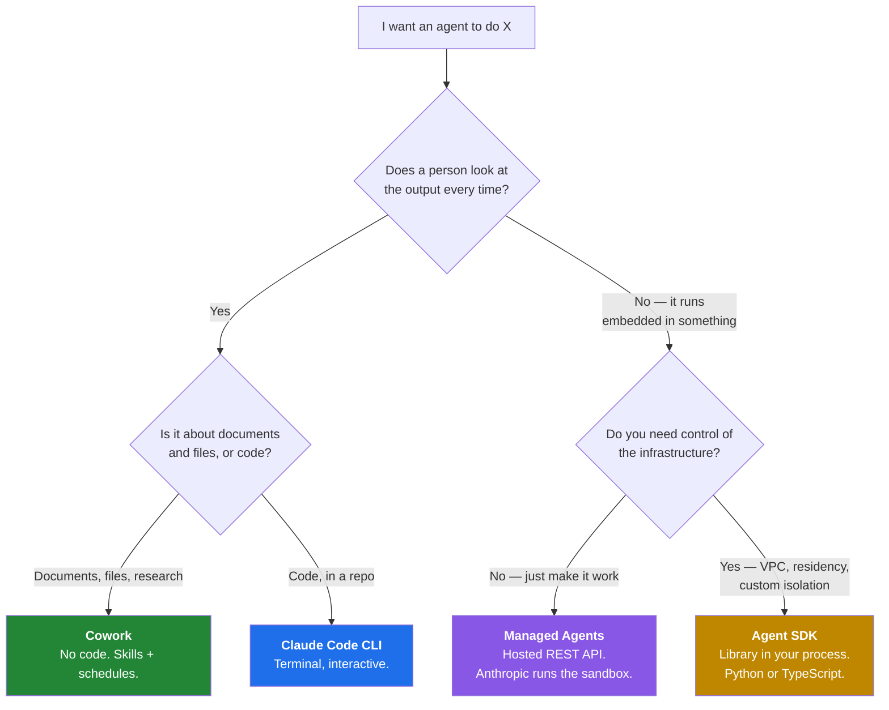
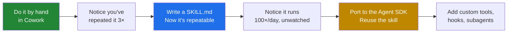

# 2 · Cowork, Claude Code, the Agent SDK, or Managed Agents?

There are four ways to run a Claude agent. Picking the wrong one costs you weeks. Here's the decision, made once, clearly.

---

## The 30-second version

## The four, side by side

| | **Cowork** | **Claude Code CLI** | **Agent SDK** | **Managed Agents** |
|---|---|---|---|---|
| **Shape** | Desktop/web/mobile app | Terminal | Library (Python, TS) | Hosted REST API |
| **Who runs it** | A person, or a schedule | A developer | Your application | Your application |
| **Runs where** | Anthropic's cloud | Your machine | Your infrastructure | Anthropic's infrastructure |
| **Setup cost** | A paid plan | `npm i -g` | API key + runtime + deploy target | API key |
| **You customise with** | Skills, plugins, connectors, projects | Skills, CLAUDE.md, MCP, hooks | All of that, plus code | The API surface |
| **You operate** | Nothing | Nothing | Containers, sessions, scaling, telemetry | Nothing |
| **Best at** | Judgment work on files, run by the person who needs it | Interactive development | Repeatable work embedded in a product | Long-running async agents without infra |

## The rule that holds up

> **If a person is going to look at the output every time, start with Cowork.**
> Move to the SDK when the same task runs a hundred times a day and nobody is looking.

Most of the disappointment around agent projects comes from skipping that first sentence — building a bespoke SDK service for something one analyst runs twice a week, then spending the quarter on deployment rather than on the work.

The reverse mistake is rarer but more expensive: running a customer-facing, high-volume process by hand in a desktop app.

## Where the SDK is genuinely the answer

Four situations where nothing else fits:

**1. It's embedded in your product.** Your users never see Claude; they see your feature. The agent runs inside your request path.

**2. You need a tool that only you can provide.** A validated schema, a rate-limited internal API, a lookup against your system of record. Custom tools live in your code, in version control, with tests. → [example 02](../examples/02-document-pipeline-agent/)

**3. You need a control a prompt can't give you.** "Never write outside this directory" as a system prompt is a *request*. As a `PreToolUse` hook it's a *rule*. If you'd have to defend the control in a compliance review, it has to be code.

**4. Data residency or network isolation.** The agent has to run inside your VPC, behind your egress proxy, under your logging.

## Where Cowork is genuinely the answer

**1. The work is judgment, not throughput.** Reading twelve documents and forming a view. That's a person's job with an assistant, not a pipeline.

**2. The person who needs it can't ship code.** An analyst who can write a good `SKILL.md` is more productive than a backlog ticket for an agent someone else will build in six weeks.

**3. The requirements are still moving.** Editing a Markdown file beats redeploying a service while you're still learning what the task actually is.

**4. It touches local files and a browser.** Cowork does both natively. Doing them from the SDK means building a sandbox.

## They're not rivals — skills transfer

The thing most people miss: **the Agent SDK loads skills too**, from `.claude/` and `~/.claude/`, same as Claude Code.

So the pragmatic path is usually one direction:

Each step is cheap and each one earns the next. Nobody has to guess the destination on day one.

> **One gotcha on the way:** a skill in `~/.claude/skills/` on your machine is **not** available to Cowork or cloud sessions — those load the skills enabled for your **claude.ai account**. A skill that works in your terminal will report as "not found" in a scheduled task until you enable it on the account. Details in [`cowork/README.md`](../cowork/README.md).

## What about the Client SDK?

There's a fifth option that isn't an agent framework at all: the **Client SDK** gives you direct access to the Anthropic API, and you implement the tool loop yourself.

Choose it when you want the model but explicitly do *not* want the agent harness — you have your own orchestration, your own context management, your own retry logic, and adding a second loop would fight it.

If you're writing your own agent loop from scratch for any other reason, you're rebuilding the Agent SDK with fewer tests.

## Languages

The Agent SDK is a library for **Python and TypeScript only**. To drive the same agent loop from Go, Java, Rust, or anything else, run the CLI as a subprocess with `-p` and `--output-format json`.

---

**Next:** [3 · Enterprise architecture](03-enterprise-architecture.md)
