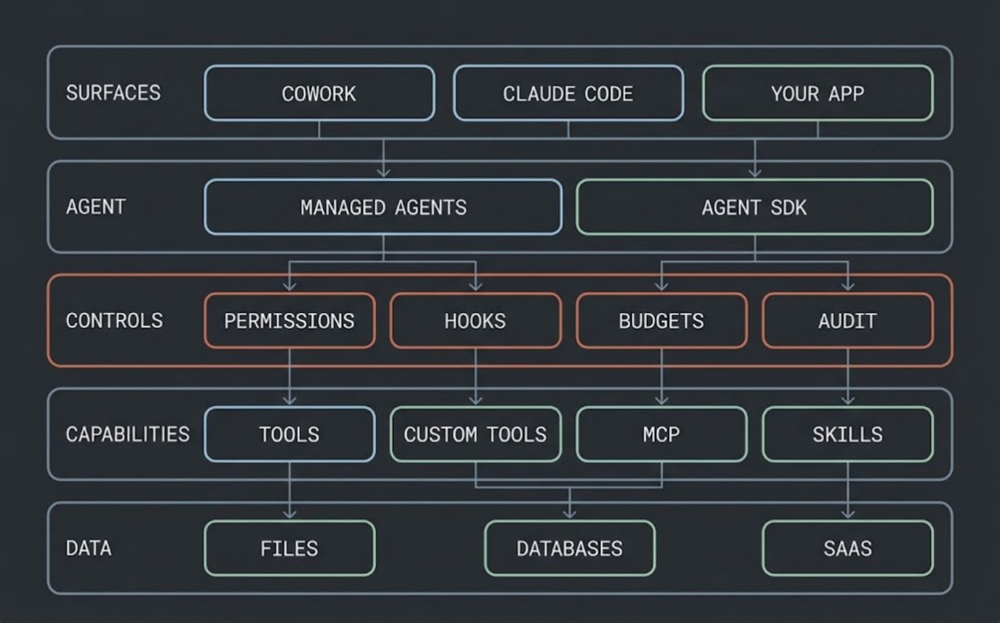
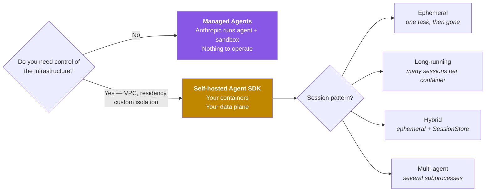

# 3 · Enterprise architecture

The reference picture for running Claude agents inside a real organisation — the layers, the trust boundaries, and the five decisions an architecture review will actually ask about.

---

## The whole picture



Five layers. The one to look at is the third.

```mermaid
flowchart TB
    subgraph People["PEOPLE"]
        direction LR
        P1["Analysts<br/>Ops · Legal · Finance"]
        P2["Developers"]
        P3["End users<br/>of your product"]
    end

    subgraph Surfaces["SURFACE LAYER"]
        direction LR
        S1["Cowork<br/>desktop · web · mobile"]
        S2["Claude Code<br/>CLI · IDE"]
        S3["Your application"]
    end

    subgraph Harness["AGENT LAYER — the loop, in all three cases"]
        direction LR
        H1["Managed Agents<br/><i>Anthropic runs it</i>"]
        H2["Agent SDK<br/><i>you run it</i>"]
    end

    subgraph Controls["CONTROL PLANE — where governance lives"]
        direction LR
        C1["Permission<br/>modes + rules"]
        C2["Hooks<br/><i>deterministic</i>"]
        C3["Subagent<br/>isolation"]
        C4["Budgets<br/>turns · dollars"]
        C5["Audit +<br/>OTEL"]
    end

    subgraph Capability["CAPABILITY LAYER"]
        direction LR
        K1["Built-in tools<br/>Read · Write · Bash · Web"]
        K2["Custom tools<br/><i>your business rules</i>"]
        K3["MCP connectors<br/>Drive · Slack · Jira · DB"]
        K4["Skills<br/><i>portable know-how</i>"]
    end

    subgraph Data["DATA + SYSTEMS OF RECORD"]
        direction LR
        D1["Documents<br/>+ file shares"]
        D2["Databases<br/>+ warehouse"]
        D3["SaaS<br/>CRM · ERP · ITSM"]
        D4["Session<br/>transcripts"]
    end

    P1 --> S1
    P2 --> S2
    P3 --> S3
    S1 --> H1
    S2 --> H2
    S3 --> H2
    S3 --> H1
    H1 --> Controls
    H2 --> Controls
    Controls --> Capability
    Capability --> Data

    style Controls fill:#3d1d00,stroke:#bf8700,stroke-width:3px
    style Harness fill:#0d2818,stroke:#238636,stroke-width:2px
```



Read it top to bottom. The thing worth noticing: **the control plane sits between the agent and every capability**. Not beside it, not after it. Every tool call passes through it, which is the only reason any of this is governable.

## The trust boundary that matters most

Most agent security thinking starts in the wrong place — at the model. Start here instead:

```mermaid
flowchart LR
    subgraph Untrusted["UNTRUSTED"]
        U1["Documents you<br/>didn't write"]
        U2["Inbound email<br/>+ messages"]
        U3["Web pages"]
        U4["Tool results from<br/>external systems"]
    end

    subgraph Boundary[" "]
        B["<b>Everything above is DATA.<br/>Never instruction.</b>"]
    end

    subgraph Trusted["TRUSTED"]
        T1["Your system prompt"]
        T2["Your hooks"]
        T3["Your tool definitions"]
        T4["The human in the loop"]
    end

    Untrusted --> Boundary --> Trusted

    style Untrusted fill:#3d0c0c,stroke:#da3633,stroke-width:2px
    style Boundary fill:#3d1d00,stroke:#bf8700,stroke-width:3px
    style Trusted fill:#0d2818,stroke:#238636,stroke-width:2px
```



A PDF a vendor sent you is exactly as trustworthy as a string in a URL parameter. It can contain text addressed to your agent. [Example 02](../examples/02-document-pipeline-agent/) ships a real one — `sample_documents/invoice-03-halcyon.txt` contains a live injection attempt, and 38 tests prove the deterministic layers hold — so you can run the defence rather than take its word for it.

Three independent layers have to fail before it does anything:

1. The **prompt** tells the agent that document content is data, never instruction.
2. The **tool list** of the agent that reads the document contains `Read` and `Glob`. A fully successful injection has nothing to reach for.
3. The **system of record** is authoritative. The document's claim about vendor status never touches the vendor master.

That's the pattern: never rely on the model to be the control. Rely on the model *plus* a narrow tool list *plus* an authoritative source, and assume any one of them can fail.

## The five decisions

An architecture review will ask these. Have answers before you build.

### 1. Where does the loop run?



**Choose the session pattern before you choose a cloud.** It determines your storage strategy, your scaling model, and your cold-start budget. [Details and the four patterns.](../examples/03-inbox-triage-service/#choosing-a-session-pattern)

### 2. What is the blast radius?

The tool list *is* the blast radius. Work down from the smallest set that can do the job, not up from "everything, minus the scary ones".

| Tools granted | What the agent can do | Reasonable for |
|---|---|---|
| *(none)* | Pure judgment over text handed to it | Classification, triage, extraction from context |
| `Read`, `Glob`, `Grep` | Read-only analysis | Search, review, summarisation |
| `+ Write` | Produce artifacts | Reports, briefs, structured output |
| `+ WebSearch`, `WebFetch` | Reach the internet | Research |
| `+ Bash` | Anything the shell can do | Automation you have genuinely bounded |

[Example 03](../examples/03-inbox-triage-service/) grants **zero tools**, deliberately. The most secure tool is the one you did not grant.

### 3. Where does state live?

Three kinds of agent state default to local disk, and **none of them survive a container restart**:

| State | Default location | Durable? |
|---|---|---|
| Session transcripts | `~/.claude/projects/` or `$CLAUDE_CONFIG_DIR/projects/` | ❌ → use a `SessionStore` |
| `CLAUDE.md` memory | `~/.claude/CLAUDE.md` + session cwd | ❌ → mounted volume or object-store sync |
| Working-directory artifacts | The session's cwd | ❌ → same |

`SessionStore` mirrors **transcripts only**, and mirror writes are **best-effort** — a failed batch emits `{ type: "system", subtype: "mirror_error" }` and the query continues. Alert on those: the service keeps answering correctly while its memory quietly develops holes, so nothing else will tell you.

A working adapter is in this repo at [`examples/03-inbox-triage-service/src/session-store.ts`](../examples/03-inbox-triage-service/src/session-store.ts), with the six contract details that are easy to get wrong — uuid idempotency, `null` vs `[]`, storage-clock `mtime`, tenant-scoped `projectKey`, serialised summary folds, and no-uuid entries — each pinned by a test.

### 4. How is one tenant kept out of another's context?

In a shared container, default SDK behaviour reads settings and `CLAUDE.md` off the filesystem. That's how one tenant's context ends up in another's prompt. Four settings, and skipping any one of them leaves the hole open:

```python
ClaudeAgentOptions(
    setting_sources=[],                 # no filesystem settings
    env={
        "CLAUDE_CODE_DISABLE_AUTO_MEMORY": "1",   # loads regardless of setting_sources
        "CLAUDE_CONFIG_DIR": per_tenant_config,   # don't share ~/.claude.json
    },
    cwd=per_tenant_dir,                 # separate filesystem per tenant
)
```

Plus per-tenant egress rules at your proxy — distinct outbound IPs, credentials, or domain allowlists — so a compromised tenant can't exfiltrate through another's outbound policy.

`CLAUDE_CODE_DISABLE_AUTO_MEMORY` is the one people miss: auto memory loads into the system prompt **regardless of `setting_sources`**.

> In TypeScript, `env` **replaces** the subprocess environment — spread `...process.env`. In Python it **merges**. This asymmetry has cost people an afternoon.

### 5. How do you know what it did?

Three layers, and you want all three:

| Layer | Mechanism | Answers |
|---|---|---|
| **Per-call audit** | `PreToolUse` / `PostToolUse` hooks → JSONL | "What did it attempt, and what came back?" |
| **Per-run cost** | `total_cost_usd` on `ResultMessage` | "What did this cost?" |
| **Fleet telemetry** | OTEL traces, metrics, logs from the environment | "Where did the fleet stall, and how often?" |

Prompt text and tool inputs are **not** in OTEL exports by default. Correct default. Turn it on only where your retention policy can hold customer content.

## Governance model that survives contact

```mermaid
flowchart TD
    subgraph Prevent["PREVENT — before the call"]
        A1["Narrow tool lists"]
        A2["PreToolUse hooks<br/><i>deny deterministically</i>"]
        A3["Permission callbacks<br/><i>allow · deny · rewrite</i>"]
        A4["Egress allowlist"]
    end
    subgraph Bound["BOUND — during the run"]
        B1["max_turns"]
        B2["max_budget_usd"]
        B3["Concurrency semaphore"]
        B4["Subagent isolation"]
    end
    subgraph Observe["OBSERVE — after the fact"]
        C1["Audit log"]
        C2["Per-run cost"]
        C3["OTEL"]
        C4["Human review queue"]
    end
    Prevent --> Bound --> Observe
    Observe -.->|"tune"| Prevent

    style Prevent fill:#0d2818,stroke:#238636,stroke-width:2px
    style Bound fill:#3d1d00,stroke:#bf8700,stroke-width:2px
    style Observe fill:#0c2d6b,stroke:#1f6feb,stroke-width:2px
```



The dotted line is the point. What you learn in **observe** is what you tighten in **prevent** — a review queue that never surfaces a bad decision means your prompts are too cautious; one that surfaces the same class of decision every week is a missing hook.

## The maturity path

| Stage | What exists | What it costs | Signal to move on |
|---|---|---|---|
| **0 · Ad hoc** | People use Cowork individually | A paid plan | The same task, done by hand, three times |
| **1 · Repeatable** | Skills shared across the team | An afternoon per skill | It runs on a schedule and nobody watches |
| **2 · Embedded** | Agent SDK in a product or pipeline | Real engineering | Volume, or a compliance requirement |
| **3 · Governed** | Hooks, audit, OTEL, tenant isolation | Platform work | Multiple teams shipping agents |
| **4 · Platform** | Shared harness, catalogue, cost attribution | A team | You've lost count of the agents |

Most organisations should be at stage 1 and honest about it. Stage 3 built before stage 1 is a governance framework for agents nobody uses.

---

**Next:** [4 · Deployment guide](04-deployment-guide.md) · [5 · Security and governance](05-security-and-governance.md)
