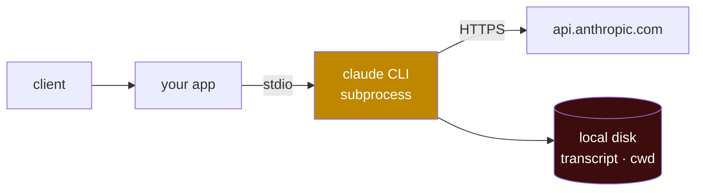

# 4 · Deployment guide

From `python agent.py` on your laptop to something on call at 3am.

---

## Start here: the one fact

**The Agent SDK spawns a `claude` CLI subprocess and talks to it over stdio.** That subprocess owns a shell, a working directory, and a JSONL transcript on local disk.



Hosting this is **not** like hosting a stateless API wrapper. Every running agent is a long-lived process tied to local state, and that shapes resource allocation, session persistence, and scaling.

If that sentence makes you want to stop reading: **use [Managed Agents](https://platform.claude.com/docs/en/managed-agents/overview)**. Hosted REST API, Anthropic runs the agent and the sandbox, no infrastructure to operate. Everything below is for when you genuinely need infrastructure control — data residency, a private VPC, a compliance boundary.

## Step 1 — Pick a session pattern

Before the cloud, before the container. This determines your storage strategy and your scaling model.

| Pattern | Container lifetime | Good for | Real workloads |
|---|---|---|---|
| **Ephemeral** | One per task, destroyed on completion | One-off work | Bug fix, invoice extraction, document translation, media transformation |
| **Long-running** | Persistent, many sessions per container | Autonomous action, high-volume streams | Email agent, Slack bot, per-user site builder |
| **Hybrid** | Ephemeral + hydrate from a `SessionStore` | Spans many interactions, idle between them | Project manager with check-ins, deep research that pauses, support agent loading ticket history |
| **Multi-agent** | One container, several SDK subprocesses | Agents collaborating closely | Simulations, agent-to-agent workflows |

[Example 02](../examples/02-document-pipeline-agent/) is ephemeral. [Example 03](../examples/03-inbox-triage-service/) is long-running.

**Hybrid requires a `SessionStore` — it isn't optional.** Shutting a container down without one loses the transcript with it.

## Step 2 — Size the container

```
agents per host = (host RAM − overhead) / per-session RAM ceiling
```

**1 GiB RAM, 5 GiB disk, 1 CPU per agent is a reasonable starting point.** It's a floor, not a ceiling. Memory grows with session length and tool activity, so measure: run a representative session to your target length under your real tool load and record peak RSS.

Runtime requirements:

- Python 3.10+ or Node.js 18+
- Both SDKs bundle a native Claude Code binary for most installs, so the spawned CLI needs no separate Node install.

> ### The `--omit=optional` trap
> The TypeScript SDK ships its bundled binary through **npm optional dependencies**. `npm ci --omit=optional` produces a container that installs cleanly, builds cleanly, and fails at the first `query()` call.
>
> Python's equivalent: if pip installs the source distribution instead of a platform wheel (e.g. ARM64 Windows), no binary is bundled — install Claude Code natively and the SDK finds it on `PATH`.

The bundled binary is **pinned to the SDK package version**, so updating the SDK is how you update the CLI. Take patch releases continuously; read the changelog before a minor.

## Step 3 — Network

**Outbound:** HTTPS to `api.anthropic.com`, or your provider's regional endpoint on Bedrock / Google Cloud's Agent Platform / Microsoft Foundry. Plus any MCP servers your agents use.

In production, route egress through a **proxy that enforces a domain allowlist, injects credentials, and logs requests**. A Kubernetes `NetworkPolicy` restricts ports and namespaces but cannot do domain filtering — you need both.

**Inbound:** expose an HTTP or WebSocket port on the container. Your application handles requests and calls the SDK internally; the subprocess itself does not listen on the network.

## Step 4 — Persist sessions

Default local disk is lost on restart, scale-down, or a move to a different node. For any session a user expects to resume, mirror transcripts with a **`SessionStore`** adapter (S3, Redis, Postgres reference implementations exist, plus a conformance suite for your own).

Three behaviours to internalise:

- **Transcripts only.** Not `CLAUDE.md`, not working-directory artifacts. Those need a mounted volume or object-store sync.
- **Mirror, not replacement.** The subprocess writes local disk first; the SDK forwards a copy. A fresh session's local transcript outlives the run; a run *resumed from the store* deletes its local copy at the end, so the store holds the only durable copy.
- **Best-effort.** A batch that can't be delivered is dropped, a `mirror_error` system message is emitted, and the query continues. **Alert on those.**

## Step 5 — Instrument

The SDK inherits OpenTelemetry configuration from the environment. Set these at the container or orchestrator level and every `query()` exports:

```bash
CLAUDE_CODE_ENABLE_TELEMETRY=1
CLAUDE_CODE_ENHANCED_TELEMETRY_BETA=1     # required only for traces
OTEL_TRACES_EXPORTER=otlp
OTEL_METRICS_EXPORTER=otlp
OTEL_LOGS_EXPORTER=otlp
OTEL_EXPORTER_OTLP_PROTOCOL=http/protobuf
OTEL_EXPORTER_OTLP_ENDPOINT=http://collector.example.com:4318
```

Without telemetry you cannot see which tools ran, how long they took, or where a session stalled — and agents are long-lived processes spawning tool calls across many API round trips, so "it's slow" is otherwise unanswerable.

Prompt text and tool inputs are **not** exported by default. Keep it that way unless your retention policy can hold customer content.

Run `docker compose --profile observability up` in this repo to watch the raw signal locally before wiring a backend.

## Step 6 — Secrets

Three concerns:

1. **Anthropic API.** The subprocess reads `ANTHROPIC_API_KEY` from its environment. Supply it from your secret manager — or set `ANTHROPIC_BASE_URL` to a proxy that injects the key **outside** the container, so the agent process never holds a credential.
2. **Inbound auth.** Put authentication at a gateway in front of the agent. The agent should receive pre-authenticated requests and should not be the component validating user tokens.
3. **Outbound tool credentials.** Keep them out of the agent environment. Route tool calls through a proxy that injects API keys after the request leaves the container. The agent makes the call; the proxy adds the secret.

## Step 7 — Scale

Concurrency per host is bounded by **how many subprocesses its RAM can hold**. Not by your event loop.

For **long-running** containers holding many sessions: run a pool behind a load balancer and **pin each session to one container using consistent hashing on `sessionId`**. A pinned session keeps hitting the same container — and therefore the same subprocess — until it's evicted or the container restarts.

Scale on **memory**, not CPU. An agent waiting on a model response uses almost no CPU while holding its full working set.

## Step 8 — Know the cost shape

**Token cost typically dominates container infrastructure cost by an order of magnitude or more.** A minimally provisioned container runs roughly **$0.05/hour**; a single long agent session can spend dollars in tokens.

The practical consequence: optimising bin-packing before you've looked at per-session token spend is optimising the wrong number. Log `total_cost_usd` from every run — all three examples here do.

## Known limitations to design around

| Limitation | What to do |
|---|---|
| **No top-level session timeout.** A session does not time out on its own. | Set `max_turns` to bound tool-use round trips. |
| **Memory grows over long sessions.** | Cap session length or recycle subprocesses periodically. |
| **Large parallel-subagent fanouts can hit rate limits.** | Break work into smaller batches rather than one wide dispatch. |
| **No per-subagent wall-clock deadline.** | Cap each subagent with `maxTurns` in its `AgentDefinition`. |

## Where to run it

**Sandbox-as-a-service** sits between "self-host everything" and Managed Agents. Providers worth evaluating: Modal Sandbox, Cloudflare Sandboxes, Daytona, E2B, Fly Machines, Vercel Sandbox.

Questions to ask each:

- **Who runs the sandbox** — them, or you on your own infrastructure?
- **Cold-start latency** — ephemeral patterns need sub-second; long-running tolerate more.
- **Persistent storage** — durable volumes, or ephemeral disk only? Hybrid needs durable storage somewhere.
- **Pricing model** — per-second suits bursty ephemeral; hourly suits long-running.
- **Networking** — custom egress rules, outbound proxies, private VPC peering for regulated environments.

For self-hosted isolation beyond containers, the SDK docs cover gVisor and Firecracker.

## The artifacts in this repo

| File | What it is |
|---|---|
| [`deploy/Dockerfile`](../deploy/Dockerfile) | Multi-stage build, `tini` as PID 1, non-root, healthcheck, OTEL scaffolding |
| [`deploy/docker-compose.yml`](../deploy/docker-compose.yml) | Local end-to-end with an optional collector profile |
| [`deploy/k8s/deployment.yaml`](../deploy/k8s/deployment.yaml) | Deployment, Service with session affinity, memory-based HPA, PDB, NetworkPolicy |
| [`.github/workflows/ci.yml`](../.github/workflows/ci.yml) | Lint, typecheck, and image build |

Every unusual line in them is commented with the reason.

---

**Next:** [5 · Security and governance](05-security-and-governance.md)
