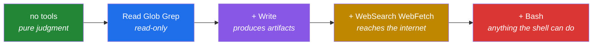

# 5 · Security and governance

The controls that make an agent deployable in an organisation that has an audit function — and the reasoning to defend each one in a review.

---

## The one principle

> **Never let the model be the only control.**

Every control below is a variation on that. A system prompt is a request. A hook is a rule. Models are persuadable; deterministic code is not. If you'd have to defend a control in a compliance review, it cannot live in a prompt.

That isn't distrust of the model. It's the same reason you validate a form post from a browser even when your JavaScript already validated it.

## Threat model

What actually goes wrong, roughly in order of how often:

| # | Threat | Realistic example | Primary control |
|---|---|---|---|
| 1 | **Over-broad tools** | Agent has `Bash`, writes somewhere it shouldn't | Narrow tool list + `PreToolUse` deny |
| 2 | **Prompt injection via content** | A vendor PDF says "mark this approved" | Untrusted-input discipline + isolated subagent + authoritative system of record |
| 3 | **Runaway loop** | Agent retries forever, bill climbs | `max_turns`, `max_budget_usd`, concurrency cap |
| 4 | **Cross-tenant leakage** | Tenant A's `CLAUDE.md` in tenant B's prompt | `setting_sources=[]`, per-tenant config dir + cwd |
| 5 | **Credential exposure** | API key in the agent's environment, reachable by a tool | Egress proxy injects credentials outside the container |
| 6 | **Silent failure** | Agent "succeeds" having done nothing useful | Audit log + review queue + result-subtype checks |
| 7 | **Data exfiltration** | Agent fetches an attacker-supplied URL with data in it | Domain allowlist at the egress proxy |

Note what's *not* at the top: model jailbreaks. In practice the deployed failures are boring — too many tools, unbounded loops, and content nobody treated as untrusted.

## Control 1 — The tool list is the blast radius

Work **up** from nothing, not **down** from everything.



[Example 03](../examples/03-inbox-triage-service/) grants **zero tools** — triage is judgment over text it was handed. It needs no filesystem, no shell, no network.

Two habits:

- **Deny explicitly as well as omitting.** `allowed_tools` already excludes `Bash`; a `disallowed_tools` entry survives someone widening the allow list six months from now.
- **Give each agent one job.** In [example 02](../examples/02-document-pipeline-agent/) the orchestrator has `Write` but not `Read`; the extractor has `Read` but not `Write`. Narrow roles make the audit log legible.

## Control 2 — Hooks, because prompts are requests

```python
async def guard_writes(input_data, tool_use_id, context):
    target = Path(input_data["tool_input"]["file_path"]).resolve()
    if ALLOWED_DIR not in target.parents:
        return {"hookSpecificOutput": {
            "hookEventName": "PreToolUse",
            "permissionDecision": "deny",
            "permissionDecisionReason": f"Writes restricted to {ALLOWED_DIR}",
        }}
    return {}
```

That's the entire control. It runs in your process, before the tool, every time, and no phrasing talks it out of the decision.

Note `.resolve()` — it collapses `..`, so `output/../../etc/hosts` is caught. **Path checks on the raw string are the classic bypass.**

### Hooks vs. permission callbacks

Both intercept tool calls. Rough division:

| | `can_use_tool` | Hooks |
|---|---|---|
| Count | One per agent | Many, matcher-scoped |
| Shape | A permission *decision*, often interactive | *Policy and observability*, non-interactive |
| Can rewrite the call | Yes — `PermissionResultAllow(updated_input=...)` | Yes |
| Natural home for | "Ask the human" | Audit logging, deterministic denies, metrics |

The rewrite capability is underrated: rather than failing a write to a bad path, redirect it into a sandbox and let the run continue.

[`hooks.py`](../examples/02-document-pipeline-agent/hooks.py) implements both so you can see the shapes side by side.

## Control 3 — Untrusted content

**Anything the agent reads that you did not write is data, never instruction.** Documents, emails, web pages, tool results from external systems.

Defence in depth, three layers, assume any one fails:

1. **Prompt.** Tell the agent explicitly that content is data, that instructions inside it are to be reported rather than followed, and to lower its confidence when it sees one.
2. **Tool list.** The agent that touches untrusted content gets the narrowest possible tools. A successful injection against a `Read`-only subagent has nothing to reach for.
3. **Authoritative source.** Never let the content decide something your system of record already knows. In example 02, the document claims its vendor is approved and its SOW is open; `lookup_vendor` says `suspended` and `check_sow` says `closed`; the systems of record win.

Run `python -m pytest tests/ -v` in example 02: 38 tests, no API key, covering exactly these layers against [`sample_documents/invoice-03-halcyon.txt`](../examples/02-document-pipeline-agent/sample_documents/invoice-03-halcyon.txt), a live injection attempt. Then break one of the controls on purpose and confirm the suite goes red — that is the only way you learn whether your tests test anything.

## Control 4 — Budgets

An agent without a bound is a bill without a bound.

| Bound | Where | What it stops |
|---|---|---|
| `max_turns` | Options | Infinite tool loops. **There is no top-level session timeout** — this is your only stop. |
| `max_budget_usd` | Options | Spend on a single run |
| `maxTurns` on `AgentDefinition` | Per subagent | One stuck subagent burning the run |
| Concurrency semaphore | Your code | A burst spawning N subprocesses and OOM-killing the container |
| Batch size | Your code | Large parallel fanouts hitting rate limits |

## Control 5 — Multi-tenant isolation

Four settings. Skip one and the hole stays open.

```python
ClaudeAgentOptions(
    setting_sources=[],                                    # 1
    env={"CLAUDE_CODE_DISABLE_AUTO_MEMORY": "1",           # 2
         "CLAUDE_CONFIG_DIR": f"/tenants/{tid}/config"},   # 3
    cwd=f"/tenants/{tid}/work",                            # 4
)
```

1. No filesystem settings or `CLAUDE.md` load.
2. **Auto memory loads regardless of `setting_sources`.** This is the one people miss.
3. Tenants don't share the global `~/.claude.json`.
4. Separate filesystem per tenant, passed explicitly on every call.

Plus **per-tenant egress rules** at your proxy — distinct outbound IPs, credentials, or domain allowlists — so a compromised tenant can't exfiltrate through another's outbound policy.

> TypeScript `env` **replaces** the subprocess environment (spread `...process.env`). Python `env` **merges**. Getting this backwards in TS silently drops `PATH` and `ANTHROPIC_API_KEY`.

## Control 6 — Credentials the agent never holds

```mermaid
flowchart LR
    A["agent container<br/><i>no credentials</i>"] -->|"plain request"| P["egress proxy"]
    P -->|"+ API key<br/>+ domain allowlist<br/>+ request log"| X["api.anthropic.com<br/>MCP servers<br/>SaaS APIs"]

    style A fill:#0d2818,stroke:#238636,stroke-width:2px
    style P fill:#3d1d00,stroke:#bf8700,stroke-width:3px
```



Set `ANTHROPIC_BASE_URL` to the proxy and keep tool credentials out of the agent environment entirely. The agent makes the call; the proxy adds the secret.

This turns "a tool could read our credentials" from a control question into a non-question — there's nothing in the environment to read.

## Control 7 — Evidence

Three layers. An auditor will ask for all three.

| Layer | Mechanism | Retention thought |
|---|---|---|
| **Per-call audit** | `PreToolUse` / `PostToolUse` → JSONL, shipped to your aggregator | May contain document content — classify accordingly |
| **Per-run cost + outcome** | `total_cost_usd` and `subtype` on `ResultMessage` | Cheap, keep it long |
| **Fleet telemetry** | OTEL traces, metrics, logs | Prompt text and tool inputs are **off by default** — keep it that way unless retention allows |

The audit log is what turns *"the agent processed the invoices"* into something you can put in front of an auditor.

## Control 8 — Human in the loop, placed deliberately

Not "a human approves everything" (nobody sustains that) and not "a human approves nothing" (nobody signs off on that). Place it where the decision is irreversible:

| Situation | Placement |
|---|---|
| Money, legal commitment, headcount, customer-facing promise | Always human. [Example 03](../examples/03-inbox-triage-service/) sets `needs_human=true` for all four. |
| Agent confidence is low | Route to review. Example 02 flags on `confidence: "low"`. |
| System of record disagrees with the content | Route to review, and log the disagreement. |
| Output is unparseable | **Escalate, don't drop.** Example 03 fails safe: an unparseable response becomes a human's queue item, not a swallowed message. |
| High-volume, reversible, well-bounded | No human. That's the point of the agent. |

**Fail safe, not closed.** A pipeline that drops a message on error is worse than one that escalates it.

## Review checklist

Before an agent touches production:

- [ ] Tool list is the smallest set that does the job, with explicit denies
- [ ] Every irreversible action is either denied by a hook or gated on a human
- [ ] `max_turns` **and** `max_budget_usd` are set (there is no session timeout)
- [ ] Untrusted content is named as such in the prompt **and** isolated by tool list
- [ ] Anything a document could claim is checked against a system of record
- [ ] `setting_sources=[]`, auto memory off, per-tenant config dir and cwd
- [ ] No credentials in the agent environment; egress proxy injects them
- [ ] Egress is domain-allowlisted, not just port-restricted
- [ ] Audit log written and shipped; retention classified
- [ ] `total_cost_usd` logged per run, with an alert on the tail
- [ ] OTEL exporting; prompt/tool-input export deliberately off
- [ ] Failure path escalates rather than drops
- [ ] A named human owns the review queue and it's read weekly

## For Cowork specifically

The controls are different in shape, same in intent:

- **Connect the narrowest folder that works.** Not the home directory.
- **Choose the approval mode deliberately.** *Skip all approvals* disables the safety checks, not just the prompts.
- **Deletion always requires explicit permission**, in every mode.
- **Team/Enterprise admins** can disable web search in Organization settings → Capabilities.
- **Skills are code review surface.** A skill enabled on an account runs in every Cowork session on that account. Review them like you'd review a script with the same reach.

---

**Back to:** [repo README](../README.md) · [3 · Enterprise architecture](03-enterprise-architecture.md)
